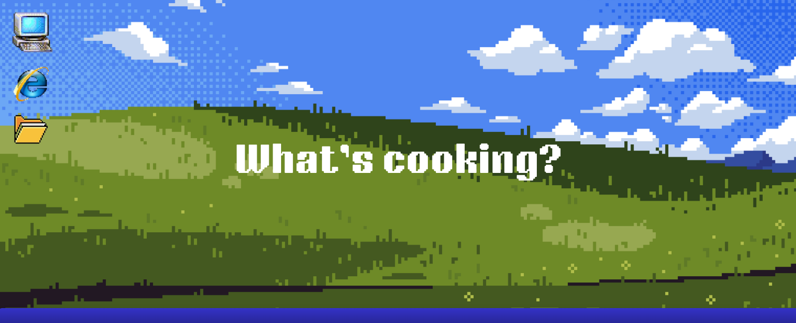

  

  
  
  

<h2 align="center"></h2>

  <picture>
    <source media="(prefers-color-scheme: dark)" srcset="https://raw.githubusercontent.com/Mitali-Patle/Mitali-Patle/output/github-contribution-grid-snake-dark.svg">
    <source media="(prefers-color-scheme: light)" srcset="https://raw.githubusercontent.com/Mitali-Patle/Mitali-Patle/output/github-contribution-grid-snake.svg">
    
  </picture>

